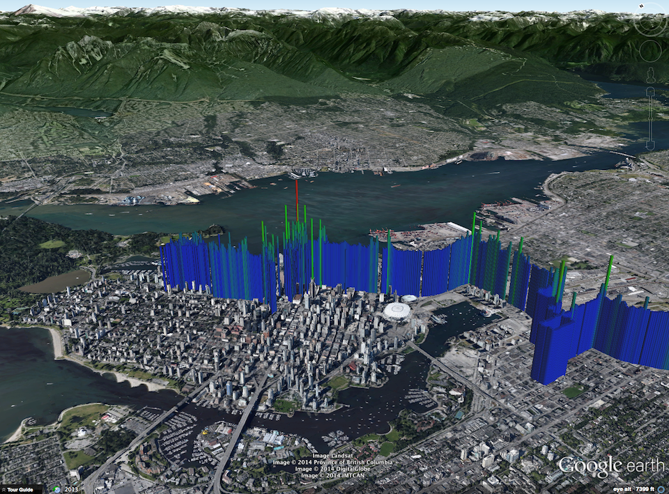
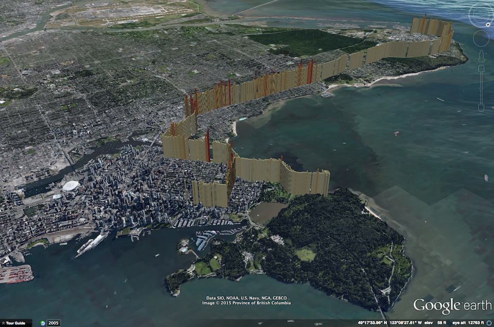
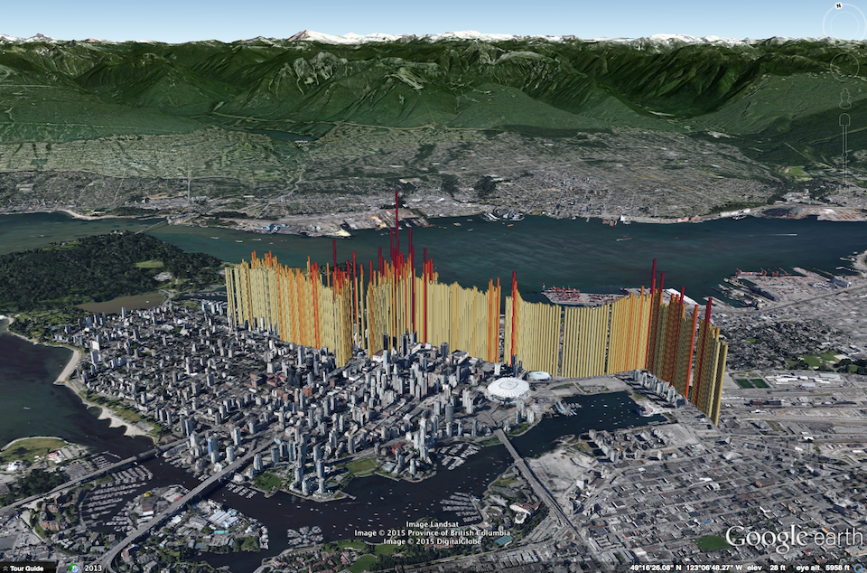
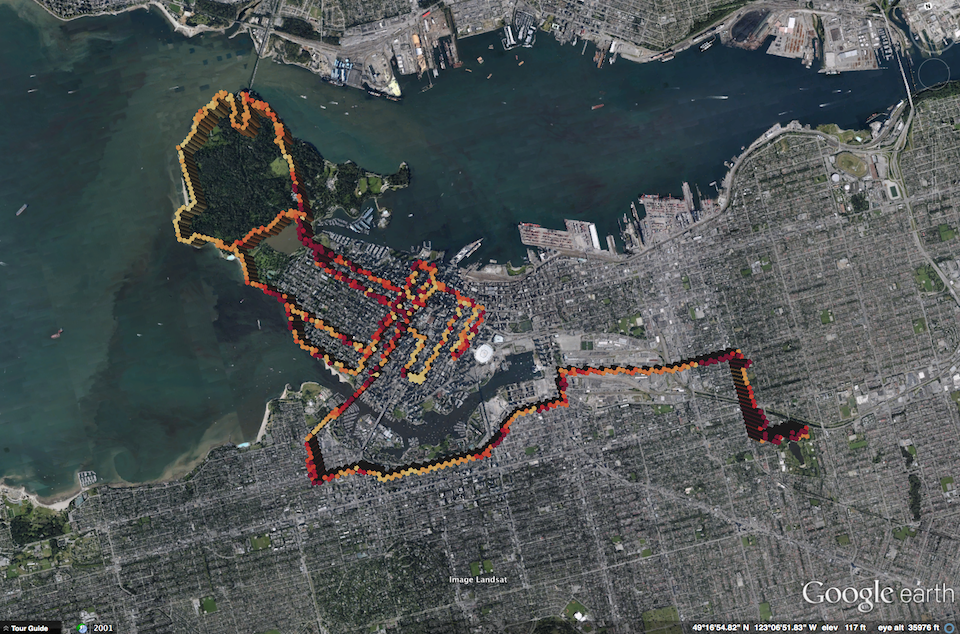
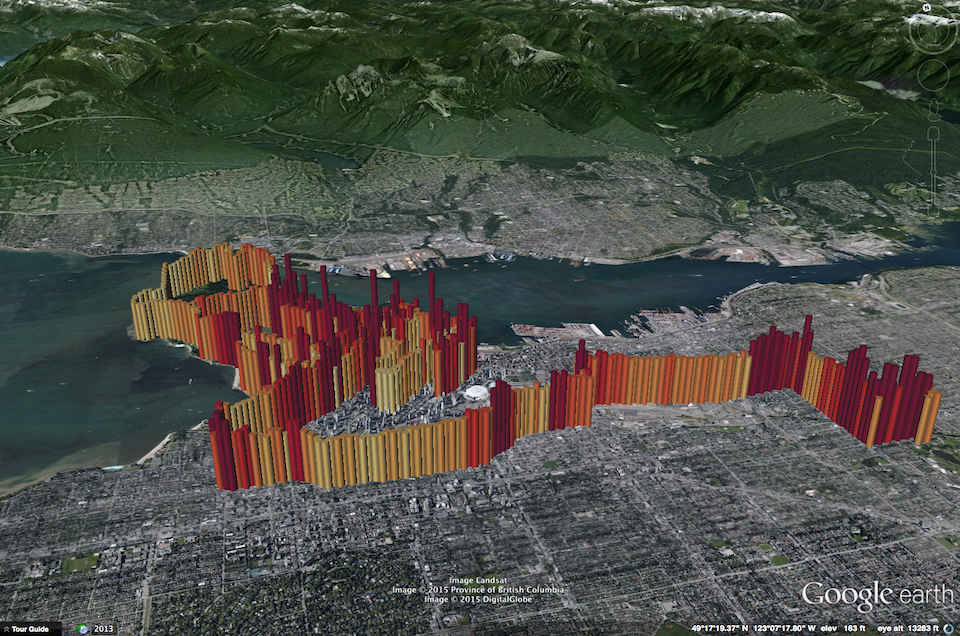

# geo2kml+
@joeyklee

# Overview
geo2kml+ is a python script that coverts a csv (with lat/lon coordinates), a point shapefile, or polygon shapefile to a kml file, extruding each polygon feature by a specified attribute to highlight a variable of interest. The lat/lon coordinates of the CSV and the shapefiles should be in WGS 84 (EPSG:4236).  This was inspired by work being done in the urban climate community visualizing greenhouse gas (GHG) traces in google earth. 

# Dependencies:
	Python 2.7
	Numpy
	Pandas
	GeoPandas
	simplekml
	colorsys
	Shapely
	Matplotlib
	
# Script Details: geo2kml+.py
There are 2 primary functions in the geo2kml+.py script:

### makedata(ifile, zfield, *args):
The makedata() function reads in the input file (ifile) and determines whether or not it is a csv, point shapefile, or polygon shapefile. 

If the input data is a csv, the data is filtered on a basic level - throwing out any records with a NULL lat/lon or zfield value - and buffers the point by 0.0001 decimal degrees. The buffer allows for the point extrusion in google earth (as far as I know only polygons can be extruded). 
	
If the input data is a point shapefile, the geometry (meaning the lat/lon coordinates) also get a buffer of 0.0001 decimal degrees for the same reason listed above.

If the inputdata is a polygon shapefile, the geometry is left as is. 

### geo2kml(ifile, zfield, ofile, inflate=1):
The geo2kml() function reads in the output from the makedata() function and turns it into the exciting KML outputs we've all been waiting for. 

The script will produce a range of colors based on the [Matplotlib colors](http://wiki.scipy.org/Cookbook/Matplotlib/Show_colormaps) which you can change in this part of the script:
	
	f2rgb = cm.ScalarMappable(norm=norm, cmap=cm.get_cmap('YlOrRd')) #RdYlGn' 

The default color range is from the minimum and maximum value of the specified 'zfield' - you can of course change this if you'd like.

The extrusion heights will vary depending on your data, so you might also want to change the 'inflate' parameter in the function to enhance the extrusion - the default inflate value is 1:
	
	geo2kml(ifile, zfield, ofile, inflate=10):
	altitude = [[i*inflate] for i in ifile[zfield]] 
	*** if you have smaller values, you could 'inflate' the value by multiplying by 10, for example. 
 
 
# Examples: geo2kml+.py

##Input: CSV

*ifile: the input file - in this case the csv file with lat/lon coordinates

*zfield: the column in the csv file that will be extruded/colored

*lon: the longitude field coordinates in wgs84

*lat: the latitude field coordiantes in wgs84

*ofile: the filepath and file name where you want the file to go/to be called

	### Set the makedata() function: (see main() function in script)
	data = makedata(ifile, zfield, lat, lon)
	*** notice that the lat, lon arguments are included here
	
	### Set the inputs 
	ifile = '~/geo2kml+/example/csv/140911141741_filtered.csv'
	zfield = 'CO2ppm'
	lon = 'GPSLondeg'
	lat = 'GPSLatdeg'
	ofile = '~/geo2kml+/example/csv/140911141741_filtered.kml'

##Input: Point Shapefile 

*ifile: the input file - in this case the point shapefile (must be projected in wgs84)

*zfield: the column in the shapefile that will be extruded/colored

*ofile: the filepath and file name where you want the file to go/to be called

	### Set the makedata() function: (see main() function in script)
	data = makedata(ifile, zfield)
	*** notice that the lat, lon arguments are omitted here

	### Set the inputs 
	# ifile = '~/geo2kml+/example/pointshp/example.shp'
	# zfield = 'altitude'
	# ofile = '~/geo2kml+/example/pointshp/example.kml'

##Input: Polygon Shapefile

*ifile: the input file - in this case the polygon shapefile (must be projected in wgs84)

*zfield: the column in the shapefile that will be extruded/colored

*ofile: the filepath and file name where you want the file to go/to be called

	### Set the makedata() function: (see main() function in script)
	data = makedata(ifile, zfield)
	*** notice that the lat, lon arguments are omitted here

	### Set the inputs 
	# ifile = '~/geo2kml+/example/polygonshp/test.shp'
	# zfield = 'MAXCo2_ppm'
	# ofile = '~/geo2kml+/example/polygonshp/test.kml'

